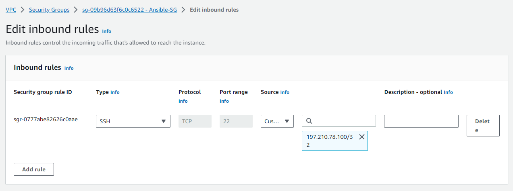

# DEPLOY WEBSITE ON MULTIPLE INSTANCES WITH ANSIBLE

STEP 1

Create the ansible security group for the ansible control machine

* enable the inbound rule for SSH that will allow for remote connection. The source will br limited to our IP address.

STEP 2

Create a security group that will be attached to the web servers

* enable inbound rules for SSH from the ansible machine and HTTP form port 80

STEP 3

Launch the ec2 instance for the ansible machine

STEP 4

Create a key pair on the ansible-machine

ssh-keygen -t rsa -b 2048